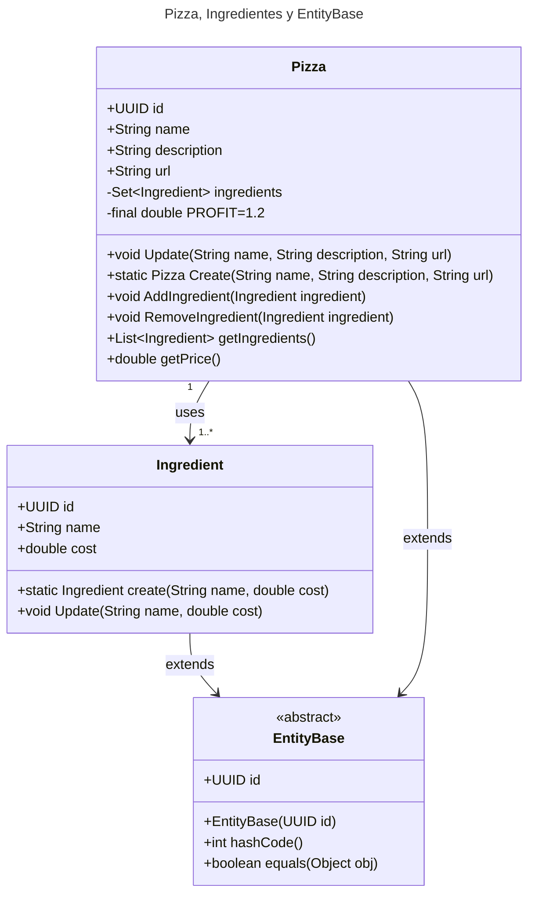

```mermaid

---
title: Pizza, Ingredientes y EntityBase
---


classDiagram
    class EntityBase {
        <<abstract>>
        +UUID id
        +EntityBase(UUID id)
        +int hashCode()
        +boolean equals(Object obj)        
    }

    class Ingredient {
        +UUID id
        +String name
        +double cost
        +static Ingredient create(String name, double cost)
        +void Update(String name, double cost)
    }

    class Pizza {
        +UUID id
        +String name
        +String description
        +String url
        +void Update(String name, String description, String url)
        +static Pizza Create(String name, String description, String url)
        +void AddIngredient(Ingredient ingredient)
        +void RemoveIngredient(Ingredient ingredient)
        +List~Ingredient~ getIngredients()
        +double getPrice()
        -Set~Ingredient~ ingredients
        -final double PROFIT=1.2
    }

    Ingredient --> EntityBase : extends
    Pizza  -->  EntityBase : extends
    Pizza "1" --> "1..*" Ingredient : uses
```