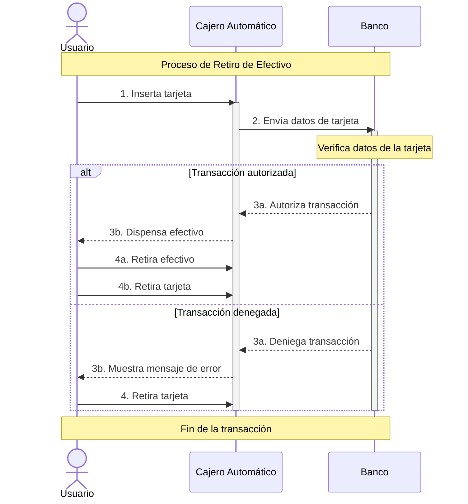

## Diagrama de Secuencia UML

### ¿Qué es un Diagrama de Secuencia UML?

Un diagrama de secuencia UML es una representación gráfica que muestra la interacción entre objetos en un sistema a lo largo del tiempo. Es como una "película" que muestra cómo diferentes objetos "hablan" entre sí para llevar a cabo una tarea específica. Estos diagramas son especialmente útiles para modelar la lógica de un sistema y entender cómo se ejecutan los procesos.

### ¿Para qué sirven los Diagramas de Secuencia?

* **Visualizar la lógica de un sistema:** Al mostrar la interacción entre objetos, los diagramas de secuencia facilitan la comprensión de cómo funciona un sistema.
* **Modelar casos de uso:** Se utilizan para representar los pasos involucrados en un caso de uso específico.
* **Identificar posibles problemas:** Al visualizar la secuencia de eventos, se pueden detectar posibles cuellos de botella o errores en el diseño.
* **Comunicar el diseño:** Son una excelente herramienta para comunicar el diseño del sistema a otros miembros del equipo.

### Componentes de un Diagrama de Secuencia

Un diagrama de secuencia consta de los siguientes elementos:

* **Participantes:** Representan los objetos que interactúan en el sistema. Se muestran como rectángulos con el nombre del objeto.
* **Línea de vida:** Es una línea vertical que se extiende desde el participante y representa la existencia del objeto a lo largo del tiempo.
* **Mensaje:** Representa la comunicación entre los objetos. Se muestra como una flecha que va de un objeto a otro. Los mensajes pueden ser sincrónicos (el emisor espera una respuesta) o asincrónicos (el emisor continúa con su ejecución sin esperar respuesta).
* **Foco de activación:** Representa el período durante el cual un objeto está ejecutando una operación. Se muestra como un rectángulo estrecho que se extiende desde la línea de vida.
* **Retorno:** Un mensaje especial que indica el valor de retorno de una operación.

[Image of a UML sequence diagram with labeled components]

### Ejemplo Práctico: Diagrama de Secuencia para un Cajero Automático

Imagina que queremos modelar el proceso de retirar dinero de un cajero automático. El diagrama de secuencia podría mostrar la interacción entre el usuario, la tarjeta, el cajero automático y el banco:

1. El usuario inserta la tarjeta.
2. El cajero automático lee la información de la tarjeta y envía una solicitud al banco.
3. El banco verifica los datos y autoriza o deniega la transacción.
4. Si se autoriza, el cajero automático dispensa el efectivo.
5. El usuario retira el efectivo y la tarjeta.

### En Resumen

Los diagramas de secuencia son una herramienta valiosa para modelar la dinámica de un sistema. Al entender los componentes y la sintaxis de estos diagramas, podrás crear representaciones visuales claras y concisas de tus diseños.

