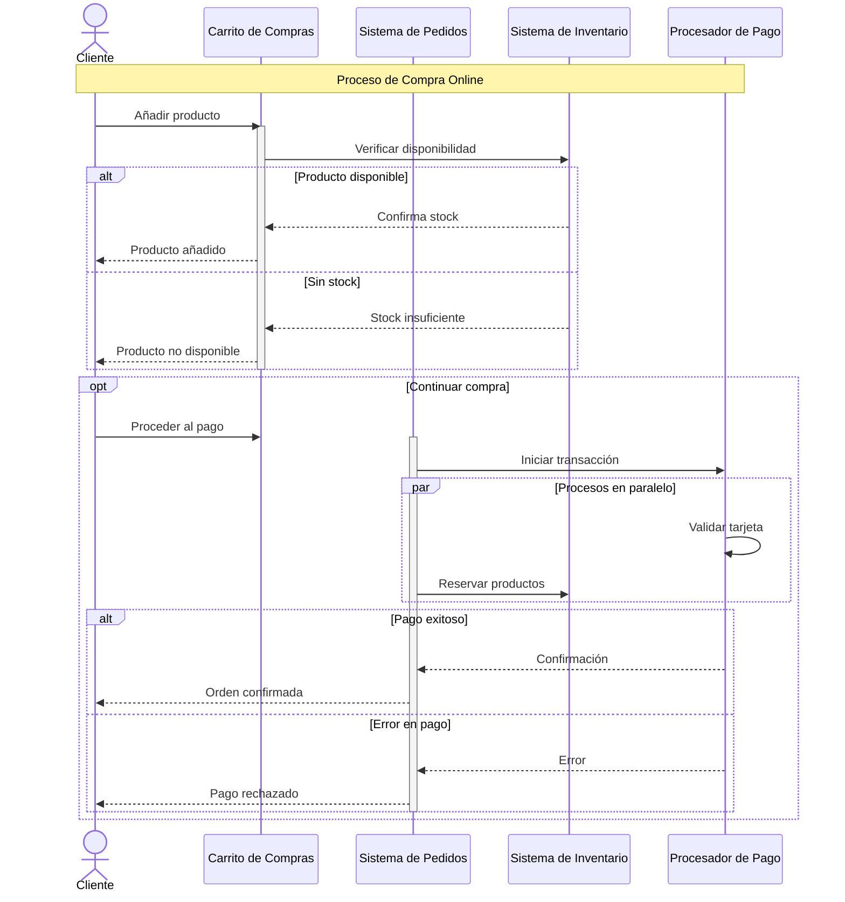

```mermaid
sequenceDiagram
    actor Cliente
    participant Carrito as Carrito de Compras
    participant Sistema as Sistema de Pedidos
    participant Stock as Sistema de Inventario
    participant Pago as Procesador de Pago

    Note over Cliente,Pago: Proceso de Compra Online

    Cliente->>Carrito: Añadir producto
    activate Carrito
    Carrito->>Stock: Verificar disponibilidad
    
    alt Producto disponible
        Stock-->>Carrito: Confirma stock
        Carrito-->>Cliente: Producto añadido
    else Sin stock
        Stock-->>Carrito: Stock insuficiente
        Carrito-->>Cliente: Producto no disponible
    end
    deactivate Carrito

    opt Continuar compra
        Cliente->>Carrito: Proceder al pago
        activate Sistema
        Sistema->>Pago: Iniciar transacción
        
        par Procesos en paralelo
            Pago->>Pago: Validar tarjeta
            Sistema->>Stock: Reservar productos
        end
        
        alt Pago exitoso
            Pago-->>Sistema: Confirmación
            Sistema-->>Cliente: Orden confirmada
        else Error en pago
            Pago-->>Sistema: Error
            Sistema-->>Cliente: Pago rechazado
        end
        deactivate Sistema
    end
```