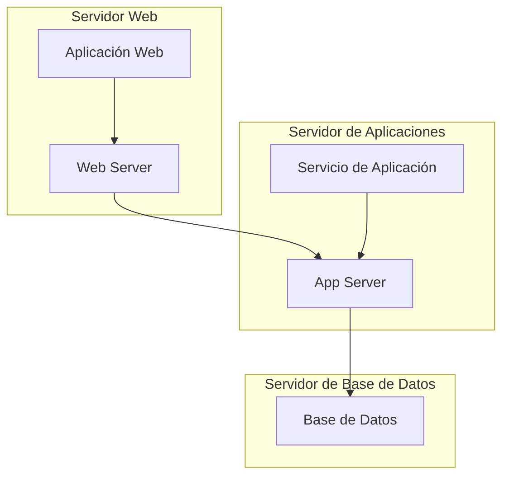

Un diagrama de despliegue en UML es una representación visual que ilustra la arquitectura física de un sistema, mostrando cómo los componentes de software se distribuyen en hardware y cómo interactúan entre sí. Se utiliza para describir la infraestructura de un sistema y su entorno, proporcionando una visión clara de cómo se implementan los componentes en los nodos de hardware.

### Componentes de un Diagrama de Despliegue

1. **Nodos**
   - **Descripción**: Representan los dispositivos físicos o entornos de ejecución en los que se despliegan los componentes de software. Los nodos pueden ser servidores, computadoras, dispositivos móviles, etc.
   - **Símbolo**: Se dibujan como rectángulos, a menudo con una pequeña "caja" que indica que es un nodo.
   - **Ejemplo**: `Servidor Web`, `Servidor de Base de Datos`.

2. **Componentes**
   - **Descripción**: Representan los módulos de software que se despliegan en los nodos. Pueden ser aplicaciones, bibliotecas, servicios, etc.
   - **Símbolo**: Se dibujan como rectángulos con un nombre que indica el componente.
   - **Ejemplo**: `Aplicación de Gestión`, `Servicio de Autenticación`.

3. **Relaciones de Comunicación**
   - **Descripción**: Indican cómo los nodos y componentes se comunican entre sí. Muestran las conexiones y la forma en que se intercambian datos.
   - **Símbolo**: Se representan como líneas conectadas entre nodos y componentes, a veces con flechas para indicar la dirección del flujo de datos.
   - **Ejemplo**: Una línea entre `Servidor Web` y `Servidor de Base de Datos` para mostrar que se realiza una consulta.

4. **Artefactos**
   - **Descripción**: Representan los archivos de software o documentos que se producen, utilizan o despliegan en el sistema.
   - **Símbolo**: Se dibujan como rectángulos con un símbolo de "archivo" en la esquina superior derecha.
   - **Ejemplo**: `Archivo de Configuración`, `Base de Datos`.

5. **Interfaces**
   - **Descripción**: Representan los puntos de acceso para interactuar con un componente o nodo. Definen cómo se comunican otros componentes con ellos.
   - **Símbolo**: Se dibujan como círculos o puntos en el borde de los componentes.
   - **Ejemplo**: `API Rest`, `Interfaz de Usuario`.

6. **Stereotypes**
   - **Descripción**: Etiquetas que se pueden aplicar a los elementos para darles una semántica adicional. Se indican con un nombre entre guiones angulares (`<< >>`).
   - **Ejemplo**: `<< componente >>`, `<< dispositivo >>`.

7. **Distribuciones**
   - **Descripción**: Muestran cómo se distribuyen los componentes en los nodos, indicando dónde se ejecutan y cómo se interconectan.
   - **Ejemplo**: Un componente `Aplicación de Gestión` que se despliega en un `Servidor Web`.

### Usos de un Diagrama de Despliegue

1. **Visualización de la Arquitectura Física**: Proporciona una representación clara de la infraestructura del sistema y cómo se conectan los componentes de software y hardware.
   
2. **Planificación de Despliegue**: Ayuda en la planificación de la implementación de un sistema, mostrando los requisitos de hardware y las interconexiones necesarias.

3. **Análisis de Desempeño**: Permite identificar cuellos de botella potenciales en la comunicación entre componentes y mejorar la arquitectura.

4. **Documentación**: Sirve como un recurso valioso para desarrolladores y administradores de sistemas, facilitando la comprensión de la configuración y despliegue del sistema.

5. **Soporte para Mantenimiento y Actualizaciones**: Facilita el mantenimiento y la actualización de un sistema al ofrecer una referencia visual sobre cómo se despliegan los componentes.

### Ejemplo de Diagrama de Despliegue
Un diagrama de despliegue típico podría mostrar un sistema web donde un servidor web está conectado a un servidor de aplicaciones y un servidor de base de datos. Cada nodo puede contener múltiples componentes, como aplicaciones y servicios que interactúan a través de redes definidas.

### Resumen
Los diagramas de despliegue son herramientas esenciales para representar la arquitectura física de un sistema, facilitando la comprensión de cómo se implementan y comunican los componentes. Su uso es crucial en la planificación, documentación y mantenimiento de sistemas complejos, proporcionando una base sólida para decisiones de diseño y implementación.